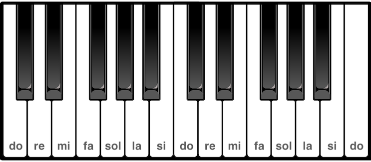

A [El nom de les notes](2022-10-10-el-nom-de-les-notes) vaig explicar que de les 12 notes que hi ha en una octava, només 7, les corresponents a les tecles blanques del piano, tenen nom: Do, Re, Mi, Fa, Sol, La i Si. Per bé que no eren ben bé aquestes, a Occident, inicialment només es feia servir un conjunt de notes semblant. Els compositors, però, aviat van trobar que, per a determinats passatges o punts concrets de les seves obres, alguna de les notes que tenien era massa alta o massa baixa. Així van començar a fer alteracions de les notes, que les elevaven o abaixaven en [altura](https://ca.wikipedia.org/wiki/Altura_(so)) <!--more--> [^1].

Avui en dia les alteracions permeten apujar o abaixar el to d'una nota en un semitò[^2]. Aquestes alteracions s'anoten amb uns símbols que anomenem [accidents](https://ca.wikipedia.org/wiki/Alteraci%C3%B3_(m%C3%BAsica)):

| Alteració         | Accident | Explicació                              |
| :-----------------: | :--------: | :--------------------------------------- |
| Sostingut o diesi | ♯ | Apuja l'altura d'una nota en un semitò  |
| Bemoll            | ♭ | Abaixa l'altura d'una nota en un semitò |

A partir d'aquí, i tenint present el teclat d'un piano, podem posar noms a les tecles negres.

Clipart: Treball derivat de "[A piano keyboard octave](https://freesvg.org/1533631532)" de [Domini públic](https://creativecommons.org/licenses/publicdomain/)
{: .figcaption}

Així, si pugem l'altura del Re en un semitò tenim un Re♯ i si l'abaixemun semitò tenim un Re♭. I ja tenim dues tecles negres del piano que fins ara no tenien nom i que ja podem designar.

A les notes corresponent a les tecles blanques del piano, que no tenen alteracions, en diem notes naturals. Les altres, com que tenen alteracions, es diuen notes alterades.

Però què passa si apugem l'altura d'un Do en un semitò? Tenim un Do♯... Però de la tecla entre el Do i el Re no en dèiem Re♭?

Un mateix so musical com ara el que fa la tecla negra que hi ha entre el Do i el Re en un piano, pot escriure's de diverses maneres igual que un mateix so fonètic es pot escriure amb diverses grafies; com ara la B i la V, que són símbols diferents però representen el mateix fonema (a molts dialectes del català). Quan dues notes tenen la mateixa altura però s'escriuen de forma diferent, com el Do♯ i el Re♭, diem que una és **enharmònica** de l'altra.

Però per què necessitem poder escriure diferent dues notes que sonen igual? Aquest és un tema força més avançat que no veurem encara. La intuïció, però, és que la mateixa altura s'escriu com una nota o com l'altra segons el context i quina funció fa a la partitura.

Cal tenir en compte que fins i tot les notes naturals (les que corresponen a les tecles blanques del piano) poden ser enharmòniques d'altres notes. Aquesta és la llista completa de notes que hi ha en una octava on, per a cada una, donem els diferents enharmònics que podem formar amb  ♭ i ♯:

|      ⬜️      |      ⬛️       |    ⬜️     |      ⬛️       |      ⬜️      |      ⬜️      |       ⬛️       |     ⬜️     |       ⬛️       |    ⬜️     |      ⬛️       |    ⬜️     |
| :---------: | :----------: | :------: | :----------: | :---------: | :---------: | :-----------: | :-------: | :-----------: | :------: | :----------: | :------: |
| Do Si♯ | Re♭ Do♯ | Re  | Mi♭ Re♯ | Fa♭ Mi | Fa Mi♯ | Sol♭ Fa♯ | Sol  | La♭ Sol♯ | La  | Si♭ La♯ | Si  |

Per a fer-ho una mica més interessant, hi ha un parell d'accidents més corresponents al doble sostingut (que apuja l'altura d'una nota en un to) i el doble bemoll (que l'abaixa un to):

| Alteració       | Accident | Explicació                                         |
| :---------------: | :--------: | :-------------------------------------------------- |
| Doble sostingut | 𝄪 | Apuja l'altura d'una nota en dos semitons (un to)  |
| Doble bemoll    | 𝄫 | Abaixa l'altura d'una nota en dos semitons (un to) |

Per últim, hi ha un accident que es fa servir per indicar que una nota és natural (que no és alterada). Es fa servir quan, pel context, caldria esperar que la nota tingués una alteració però no la té:

| Alteració | Accident | Explicació                                                   |
| :---------: | :--------: | :------------------------------------------------------------ |
| Becaire   | ♮ | Indica que l'altura de la nota no està alterada encara que pel context, si no s'indica explícitament, ho estaria. |

---

[^1]: En articles anteriors per parlar de com de greu o aguda és una nota, parlava del seu to. Tot i que crec que és correcte, ara he trobat que a la Viquipèdia, quan es parla d'alteracions, es fa servir el terme altura. Més enllà de ser, sembla ser, més utilitzat, té l'avantatge que no es confón amb el concepte de to com la distància equivalent a dos semitons.
[^2]: Introdueixo els semitons a [El nom de les notes](2022-10-10-el-nom-de-les-notes) i en medeixo la magnitud física a [El valor d'un semitò](2022-10-12-el-valor-dun-semito).
