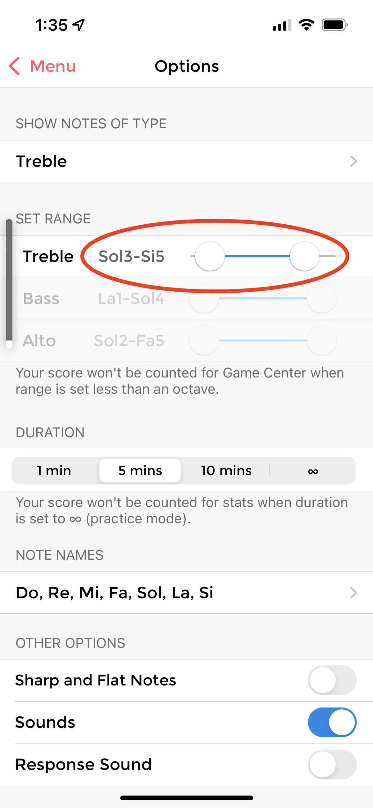

A [l'últim article](2022-10-14-notacio-altura) vaig explicar com s'anota l'altura de les notes en un pentagrama i vaig comentar que en el cas del violí fem servir la clau de Sol (en segona). Avui en faig un de curtet per parlar precisament del meu instrument, el violí[^1]. Per als principiants ens resulta molt útil situar ràpidament al pentagrama les notes que sabem tocar i això és el que em proposo resumir, on van a parar al pentagrama les notes que toquem en un violí en primera posició.

<!--more-->

Com vaig comentar, l'àmbit del violí és Sol3 - La7, però l'àmbit en primera posició és Sol3 - Si5. És a dir, si deixem la mà del violí fixa a la posició de les notes més greus, podrem tocar totes les notes entre el Sol3 i el Si5, però no podrem tocar notes més agudes que el Si 5(ni més greus que el Sol3).

El violí té 4 cordes que, tocades a l'aire, sonen, de més greu a més aguda, Sol3, Re4, La4 i Mi5. En una partitura, aquestes quatre notes són:
```music-abc
L:1/4
G, D A e
```

En la posició en que inicialment aprenem a posar la mà, anomenada primera posició, cada un dels 4 dits de la mà del violí toca una nota successiva a la corda. La nota serà una nota natural o alterada segons on posem exactament cada dit, però, de moment, no entrarem en aquest detall. 

A la partitura podem indicar amb quin dit es toca una nota posant el númer de dit petit al damunt la nota. I així representar totes les notes que podem tocar en aquesta posició. Com es pot veure, a cada corda, el quart dit produeix la mateixa nota que la corda següent a l'aire.

A la corda Sol l'índex (dit 1) fa un La, el cor (dit 2) fa un Si, l'anular (dit 3) fa un Do i el petit (dit 4) fa un Re:

```music-abc
L:1/4
   !0!G, !1!A, !2!B, !3!C !4!D
```
Les notes del violí a la corda Sol en primera posició
{:.figcaption}

A la corda Re, l'1 toca un Mi, el 2, un Fa, el 3, un Sol i el 4, un La:

```music-abc
L:1/4
    !0!D !1!E !2!F !3!G !4!A
```
Les notes del violí a la corda Re en primera posició
{:.figcaption}


La la corda La, l'1 és Si, el 2, Do, el 3, Re i el 4, Mi:
```music-abc
L:1/4
!0!A !1!B !2!c !3!d !4!e
```
Les notes del violí a la corda La en primera posició
{:.figcaption}


I, per últim, a la corda Mi, l'1, Fa, el 2, Sol, el 3, La i el 4, Si:
```music-abc
L:1/4
!0!e !1!f !2!g !3!a !4!b
```
Les notes del violí a la corda Mi en primera posició
{:.figcaption}

Així doncs, si vull aprendre a llegir les notes que em trobaré als primers llibres de Suzuki, em cal aprendre les que podeu trobar en aquest article. Si feu servir, com vaig recomanar, Music Tutor, configureu l'aplicació per a que us pregunti notes en aquest interval o en un subconjunt d'aquest (podeu practicar, per exemple, per corda):



[^1]: Anava a posar el meu i el dels meus fills, però ells en toquen d'altres, d'instruments, dels que jo, ni idea.

